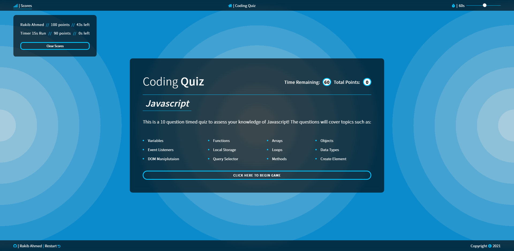

# Code Quiz

## Application Function

A self updating quiz application with content that can be changed, or the user can add more questions from different topics. This is dynamic, designed and set up with modular controls in the javascript to change certain variables of the game, giving the user the power to adjust the difficulty if they would like to challenge themselves.

## Application Link
https://strawhat19.github.io/Coding-Quiz/
